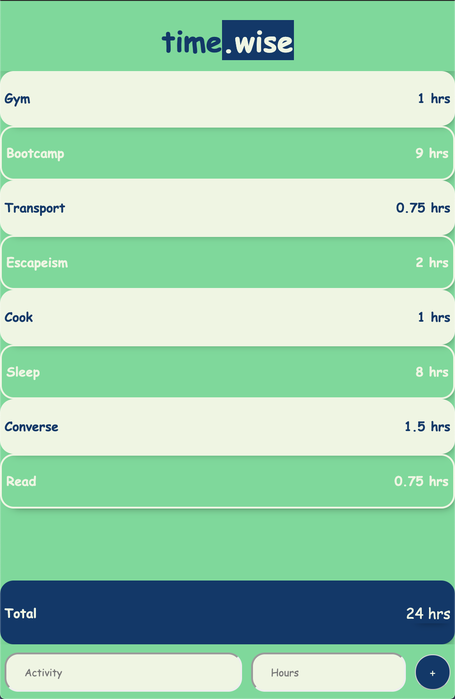

## Timewise

This is an app to show how I might spend my day these days.

### Screenshots

|          mobile          |         full screen          |
| :----------------------: | :--------------------------: |
|  |  |

## Tools used

`Flex-Box`  
`Parcel-Bundler`  
`Sass`  
`BEM`  
`PostHTML`

## Responsiveness

Content stays centered as the screen grows and has a `max-width: 700px;`.

## Design & Color Scheme

I usually take the design part a lot more serious. But not this time.

## Fonts

Felt unconventional and used `Comic Sans MS` for everything. Because of that I also thought about playing The Sims 1 as a Child and smiled. So that's a great reason to do something.
